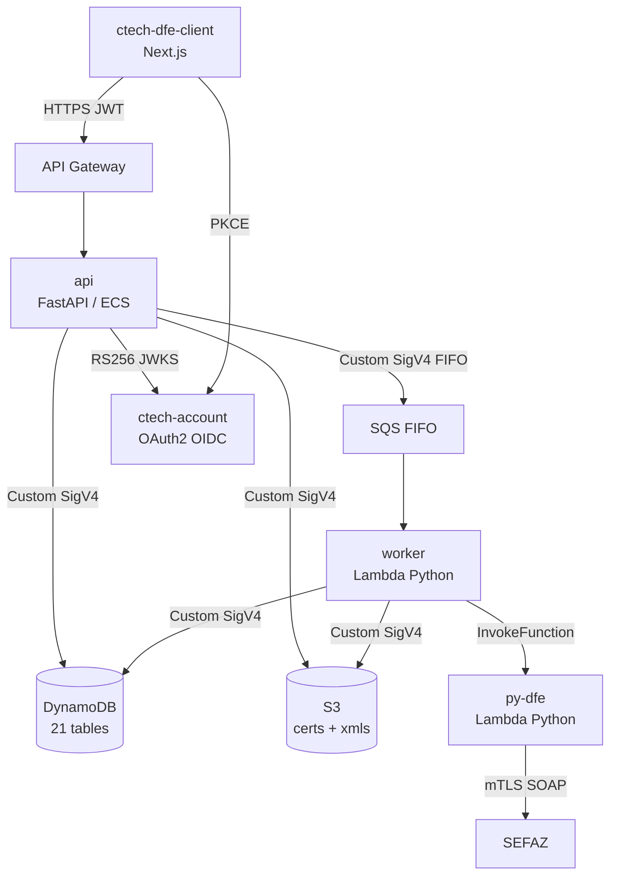
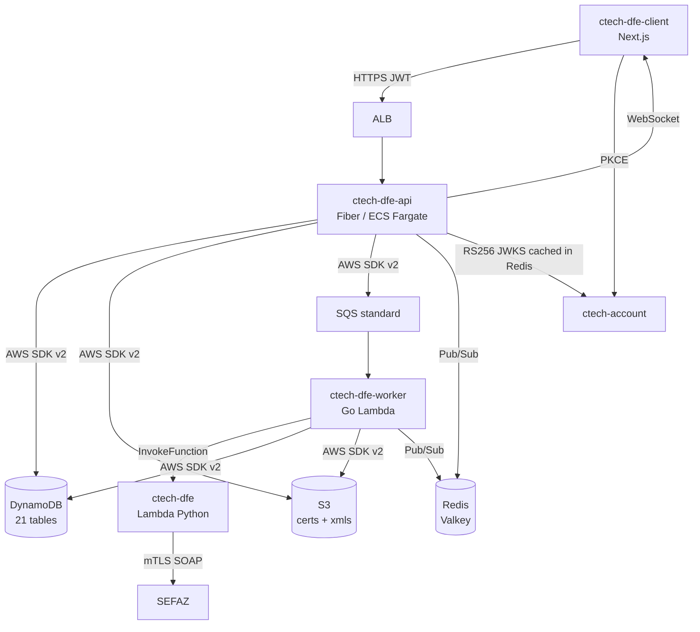
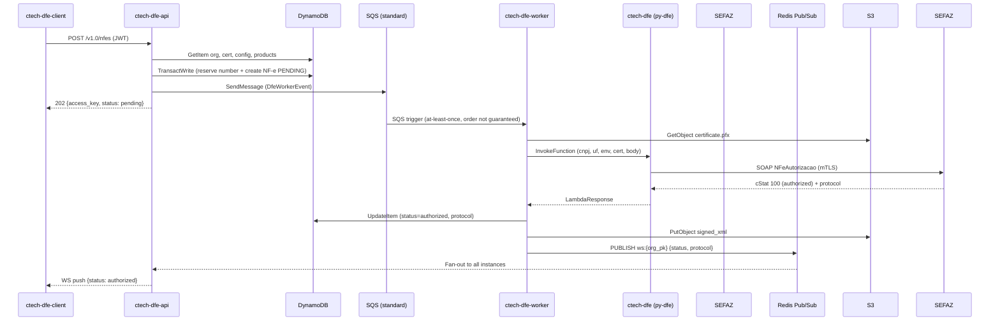

# CTech DFe — Golang Migration Architecture

> Persistent architecture reference for the py-dfe → ctech-dfe migration.
> Updated: 2026-06-09. Owner: Artur.

---

## 1. Current-State Assessment

### Strengths

| Area                     | What works                                                              |
|--------------------------|-------------------------------------------------------------------------|
| Layer separation         | Route → Service → Repository → DynamoDB enforced consistently           |
| DynamoDB access patterns | `get_item`/`query` only; `transact_write` for NF-e numbering atomicity  |
| SEFAZ isolation          | py-dfe is a clean Lambda boundary — XML-DSig + mTLS fully encapsulated  |
| Auth                     | RS256 JWKS validation; no shared secret; rotated refresh tokens         |
| Worker                   | SQS standard queues; idempotency enforced via an application-level status guard, not queue ordering |
| WebSocket                | Redis pub/sub registry already implemented (`RedisConnectionRegistry`)  |

### Weaknesses

| Area                          | Problem                                                                      |
|-------------------------------|------------------------------------------------------------------------------|
| Custom AWS client             | Hand-rolled SigV4, IMDS, retries (~800 LOC) → AWS SDK v2 replaces for free   |
| In-memory JWKS cache          | Not shared across replicas; each instance re-fetches independently           |
| `InMemoryCache` TTL=300s      | Not distributed; cache stampede possible under horizontal scale              |
| Lambda invocation synchronous | api calls Lambda directly and waits; latency + timeout coupling       |
| Worker at MVP stage           | SQS → Lambda not fully productionized                                        |
| Python GIL                    | Concurrency ceiling; memory per worker higher than necessary                 |
| py-dfe SOAP lib               | `lxml` + `signxml` + `cryptography` = 150MB+ Lambda layer; cold starts ~2–4s |

---

## 2. Scenario Decision

### Scenario A — Keep py-dfe in Python (SELECTED for Phase 1-3)

```
ctech-dfe-worker (Go)
  → aws.InvokeFunction("prod-ctech-dfe", payload)
  → ctech-dfe Lambda (Python) → XML-DSig + mTLS SOAP → SEFAZ
```

**Rationale:** py-dfe has 100+ unit tests covering XSD order, signing, SOAP envelopes.
A Go rewrite requires byte-perfect XML canonicalization — fiscal compliance risk unacceptable.
Revisit Scenario B after 10,000+ documents validated in homologação.

### Scenario B — Full Golang rewrite (Phase 4, conditional)

Precondition: Phases 1–3 stable in production for ≥3 months + extensive homologação validation.

---

## 3. Target Architecture

### ctech-dfe-api (Golang + Fiber)

```
HTTP Request
  → Fiber middleware (JWT RS256, tenant, RBAC, logging, recovery)
  → Route handler (thin — one service call, one response)
  → Service layer (business logic)
  → Repository layer (DynamoDB persistence only)
  → AWS SDK v2 (DynamoDB, S3, SQS, Lambda, Secrets Manager)
```

**Stack:**

| Concern    | Choice                                |
|------------|---------------------------------------|
| HTTP       | Fiber v2                              |
| DI         | Fx (go.uber.org/fx)                   |
| DynamoDB   | aws-sdk-go-v2/service/dynamodb        |
| Config     | caarlos0/env v11 (12-Factor)          |
| JWT        | golang-jwt/jwt v5 + manual JWKS fetch |
| JWKS cache | Redis (Valkey-compatible), TTL 1h     |
| WebSockets | Fiber + Redis Pub/Sub                 |
| Secrets    | AWS Secrets Manager SDK v2            |
| Logging    | slog (structured JSON → CloudWatch)   |

### ctech-dfe-worker (Golang Lambda)

```
SQS Event → Lambda handler
  → Parse SQSMessage → DfeWorkerEvent
  → Fetch certificate (S3)
  → Invoke ctech-dfe Lambda (Python, Scenario A)
  → Parse SEFAZ response
  → Update DynamoDB (status, protocol, xml_s3_key)
  → Upload signed XML to S3
  → Redis Pub/Sub notification → WebSocket push
```

**Runtime:** `provided.al2023` (~5MB binary). Cold start: ~100ms vs Python ~3s.

---

## 4. Migration Phases

### Phase 1 — ctech-dfe-api (8–12 weeks)

1. Fiber + Fx skeleton, AWS SDK v2, health endpoint
2. Auth middleware: RS256 JWKS + Redis cache
3. Repository layer (DynamoDB key patterns preserved exactly)
4. Services: organizations → certificates → products → persons → vehicles → fiscal configs → NF-e
5. NF-e: preserve `transact_write` atomicity for numbering
6. Parallel run: weighted ALB 10% → ctech-dfe-api, smoke test, increment, cutover

**Invariants — MUST NOT regress:**

- `transact_write` for NF-e numbering
- DynamoDB PK format: `CNPJ_...` / `CPF_...`
- `PyDfe-Organization-Pk` header name
- RS256 JWKS validation via `CTECH_JWKS_URL`
- WebSocket: Redis pub/sub keyed by `org_pk`

### Phase 2 — ctech-dfe-worker (4–6 weeks)

1. Go Lambda with `aws-lambda-go`
2. SQS standard event parsing (same schema)
3. DFe processing: S3 cert → invoke ctech-dfe → parse response → DynamoDB + S3
4. Redis Pub/Sub notification after SEFAZ response
5. DLQ handler

### Phase 3 — Infrastructure (2–4 weeks)

1. CDK stacks: rename `py-dfe-*` → `ctech-dfe-*`
2. Remove Lambda Layers stacks (Go binary needs none)
3. X-Ray tracing: API → SQS → Worker → SEFAZ Lambda
4. EventBridge: replace SNS fan-out
5. Secrets Manager: migrate from SSM Parameter Store

### Phase 4 — SEFAZ library migration (12–20 weeks, conditional)

Precondition: 10,000+ documents signed correctly in homologação with Go signer.

---

## 5. Repository Structure (Monorepo)

```
ctech-dfe/                          ← rename from py-dfe/
├── ctech-dfe-api/                  ← NEW: Go API (Phase 1)
│   ├── cmd/server/main.go
│   ├── internal/
│   │   ├── config/
│   │   ├── problem/                ← RFC 7807 errors
│   │   ├── middleware/             ← auth, tenant, recover
│   │   ├── cache/                  ← Redis + in-memory
│   │   ├── ws/                     ← WebSocket registry
│   │   ├── awsclient/              ← AWS SDK v2 wrappers
│   │   ├── repositories/
│   │   ├── services/
│   │   ├── api/v1/
│   │   └── app/                    ← Fx modules
│   ├── go.mod
│   └── Dockerfile
├── ctech-dfe-worker/               ← NEW: Go Lambda (Phase 2)
├── py-dfe/                         ← KEEP: Python SEFAZ lib
├── api/                     ← KEEP until Phase 1 cutover
├── ui/                  ← rename → ctech-dfe-client
├── cdk/                     ← rename → ctech-dfe-cdk (Phase 3)
└── worker/                  ← KEEP until Phase 2 cutover
```

---

## 6. Architecture Diagrams

### Current Architecture



### Target Architecture (Phase 1+2)



### NF-e Issuance Flow



### WebSocket Scaling

```mermaid
graph LR
    subgraph "API instances (n=3)"
        A1[ctech-dfe-api :1]
        A2[ctech-dfe-api :2]
        A3[ctech-dfe-api :3]
    end
    Client1[Browser A] -->|WS| A1
    Client2[Browser B] -->|WS| A2
    Client3[Browser C] -->|WS| A3
    subgraph "Redis (Valkey)"
        CH[Channel: ws:{org_pk}]
    end
    Worker[ctech-dfe-worker] -->|PUBLISH| CH
    A1 -->|SUBSCRIBE| CH
    A2 -->|SUBSCRIBE| CH
    A3 -->|SUBSCRIBE| CH
```

---

## 7. AWS Services

| Service         | Current              | Target                             |
|-----------------|----------------------|------------------------------------|
| DynamoDB        | Custom SigV4 aiohttp | AWS SDK v2 `dynamodb.Client`       |
| S3              | Custom SigV4 aiohttp | AWS SDK v2 `s3.Client`             |
| SQS             | Custom SigV4 aiohttp | AWS SDK v2 `sqs.Client`            |
| Lambda invoke   | Custom SigV4 aiohttp | AWS SDK v2 `lambda.Client`         |
| Secrets Manager | SSM Parameter Store  | AWS SDK v2 `secretsmanager.Client` |
| CloudWatch      | Python logging       | `slog` structured JSON             |
| X-Ray           | Not wired            | `aws-xray-sdk-go` (Phase 3)        |
| EventBridge     | Not used             | Replace SNS fan-out (Phase 3)      |

---

## 8. Risk Register

| Risk                                   | Severity | Mitigation                                               |
|----------------------------------------|----------|----------------------------------------------------------|
| XML-DSig regression                    | Critical | Keep py-dfe; Scenario B only post homologação validation |
| NF-e numbering race                    | High     | Preserve `transact_write` — load test before cutover     |
| DynamoDB key format mismatch           | High     | Integration tests vs real dev tables                     |
| Traffic cutover on month-end           | High     | Schedule cutover week 2 of month                         |
| CDK stack rename → resource recreation | High     | Import existing resources before destroy                 |
| JWKS cache stampede                    | Medium   | Redis SWR: serve stale while async refresh               |

---

## 9. Definition of Done (per Phase)

- All existing integration tests pass against Go implementation
- NF-e numbering tested under concurrent load (no duplicate numbers)
- Parallel run stable at 100% traffic for ≥48h
- CloudWatch dashboards show no regressions
- MIGRATION.md updated with cutover date and notes
